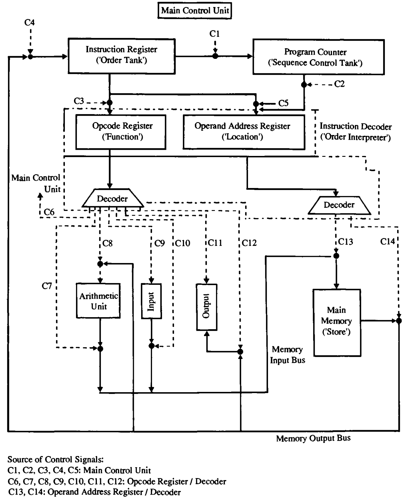

# Stored program architecture
The stored program architecture follows to the main principle of the Von Neumann architecture: the processor should fetch local data and program's code through the **same data-bus** pointing to the same component, the memory. 

In other terms, the program's code and its local variable must be stored both in memory.


# The EDSAC Computer
Let us consider the EDSAC, which was build by Maurice Wilkes. On the experience in developing this computer and seeing similar architecture after, Wilkes will later introduce the foundamental concept of *micro-programming*.

We will provide a brief description of the main components of the EDSAC computer, mainly focused on its limitations that lead Wilkes to invent micro-programming.

## The EDSAC Memory 
Memory in the EDSAC was not random-access, rather it was **sequential-access**. It was structured as a series **mercury delay lines**, that is a series of long tubes filled with mercury.

A memory word was composed of 17 bits (16 + 1 bit unused). A delay line was able to keep a 32-bit memory word.

The machine is composed of several delay lines, each containing multiple memory words. Suppose we need to retrieve a particular memory word. We know it is in a particular delay line, so we just need to access it. However a delay line contains multiple words, and to be able to keep them, they are inside a loop, formely called a **bit-train**.

Thus to retrieve that word we need to wait until it passed physically inside the output transducer. This necessity to wait is why the access is sequential.

## Order Interpreter
It is responsible for decoding a given macro-order into the associated micro-program. His role analoguos to the Instruction Decoder. During execution it receives the opcode as input, it then decodes it to *"understand"* the requested operation. Then these produced output lines will be encoded to determine the necessary control signals. 

The concrete implementation for transforming the input to the associated control signals can be represented as a regular circuit called the **diode matrix**. 


## Control Signals
In the EDSAC there are several control signals scattered across the machine and its **order interpreter**.

The control signals have three main purposes:
1. Instruct the Main Control Unit (MCU).
2. Decode the current opcode.
3. Decode the operand address or location register.

The control signals structure shows the first major weakness of the EDSAC architecture: there is no central control unit, rather control signals are distrubuted across the EDSAC and its Instruction Decoder.

### Conditional Control Signals
A conditional control signal is a signal whose activation depends on some condition, typically on the machine’s current state, or on status flags resulting from previous operations.

## EDSAC Execution
The EDSAC execution consisted of two stages. The initiation of both stages were effected by control signals.

1. An instruction is transferred from a location in memory to the instruction register. The instruction is determined by the content in the Program Counter. The operation is carried by the control signals C2 (of the main unit), C13 and C14 (of the instruction decoder).

2. The produced control signals from stage 1 are issued, causing the instruction in the instruction register to be distribuited among the opcode/function register and the operand-address/location register. The content of these register is decoded and transformed into control signals according to the particular instruction being issued.

In both stages control signals produced by different sources needs to be issued in the proper temporal order. Also depending on the instruction, the control signals sequence may vary. **The same control signal can be issued in both stages, determining a different behavior of the machine**. 
All these constrains make the control unit of the EDSAC complex and irregular.

## Arithmetic Unit
The Arithmetic Unit in the EDSAC was serial. Wilkes however found out by visiting the Institute of Advanced Study at Princeton that a parallel arithmetic unit providing the same level of efficienty as the serial approach was possible.

<!-- TODO:
        substitute the edsac_architecture image with a svg drawn by me.
 -->


# Micro-programming
Looking at the structure of the memory unit in the EDSAC, which was basically a sequence of memory word, Wilkes realized that the Main Control Unit (MCU, basically the mai processor) can be interpreted analoguously as a sequence of micro-instructions. These micro-instruction can be composed to make a complete instruction of the MCU.

Wilkes defines complexity in computer architecture as the extent to which cross-connections between the various units obscures their logical inter-relation. Simple logical structure leads to more mantainable machines.

The idea behind micro-programming is the define each machine level instruction of the *Order Code* as an high-level instruction called a **macro-order**. A macro-order is implemented as a **micro-program**: an ordered sequence of lower-level commands, called **micro-instructions**. 

A microinstruction is typically much simpler and more granular than the usual machine code, controlling the individual steps of executing machine-level instructions

These micro-operations are represented in binary as micro-code, which is stored in a special part of the memory called control memory. 

### EXAMPLE
``` 
- High-level macro-order: ADD A, B 

- Lower-level micro-instruction sequence:   
    1) Fetch the ADD instruction.
    2) Fetch the value from memory location A.
    3) Fetch the value from memory location B.
    4) Perform the addition.
    5) Store the result back in memory.
```

# Micro-programming Control Unit
The micro-programming control unit (MCU) is the concrete implementation of the micro-programming idea.  

The main structure consists of two diode matrices:
1. Matrix **A**: stores the control signals.
2. Matrix **B**: stores the address and control the selection of which control signals to issue over time.

Each horizontal line in matrix **A** stores the control signals to be issued. Each vertical line of the matrix **A** transmits a particular control signal to be issued at a given time, determined by the appropriately placed diodes. 

Recall that the execution of an instruction is divided in phases:

1. The matrix A receives as input the values produced by a decoder. 

2. The decoder receives the current requested instruction and the current time-pulse (i.e. the current phase). 

3. The produced output is a **micro-instruction**, that is *"what should be done at the current phase to complete the requested instruction"*. 

4. The output of matrices A and B which is combine to define a **micro-order**. It is the actual operation (concretely represented as a set of appropriately active control-signals) that the architecture must execute to realize the micro-instruction. 

## Diode Matrix
An array of horizontal and vertical wires, where the horizontal are the inputs of the circuit and the vertical are the outputs of the circuit. The points of intersection between horizontal al vertical wires are sites for diodes. The diode has the role of transmitting the value of the crossed wired input to the corresponding wired output.

The diode matrix can be used for the encoder of the Order Interpreter, that is from the decoded opcode lines it can be use to determine the control signals. This approach is used in the EDSAC and guaranteed regularity in the encoder implementation.

In reality as we have said previously, the execution of an order is divided in various phases (fetch, decode etc...). Each phase may consider different control signals or the same only interpreted in a different manner. To keep the sequential phases clear there have been introduced **time-signals**. These are lines which *"activate"* the wires associated to a particular phase. Additionally to consider the correct control signal of the right phase, the produced control signals of the original diode matrix are given as inputs to another diode matrix which merges them with the associated time-signals.

## Handling branches
As of now it seems that matrix B is wired such that each micro-instruction always points to the next one in a *fixed* order. This implies that the control-flow is fixed. However this is too simple and rigid: the CPU may need to behave differently depending or internal results of external conditions. 

Consider for example the execution of a conditional jump instruction, whose result is determined during the micro-instructions execution or the execution of an arithmetic operation where an overflow is detected. Depending on the particular state of the architecture the series of micro-instructions for these operation may vary considerably. 

Thus in the control store a flag bit is present at row $n-1$, which is used by matrix B to determine which micro-instruction to provide as output.

